# Essentiel de Power BI
Power BI est un ensemble de services logiciels, d’applications et de connecteurs qui œuvrent ensemble pour transformer des sources de données disparates en informations visuelles immersives et interactives. Vos données peuvent être sous forme de feuille de calcul Excel ou de collection d’entrepôts de données hybrides locaux ou sur le cloud. Power BI vous permet de vous connecter facilement à vos sources de données, de visualiser et de découvrir ce qui est important, et de partager ces informations avec qui vous voulez.

## Business Intelligence
La Business Intelligence c'est un choix d'avenir. C'est une compétence précieuse qui est de plus en plus recherchée et devient indispensable à maitriser dans le IT. C'est aussi un outil qui a été conçu pour rendre la BI accessible au plus grand nombre .
## Power BI 
Power BI est l'un des outils les plus efficients sur le marché. Et en plus il a un très bon rapport qualité prix sur le marché.

## Methodologie du Cours
Dans ce cours, nous allons suivre une methodologie part à part en cinq etapes pour que nous puissions créer nos reporting dynamic et interactif et être en mesure de partager nos travaux avec d'autres utilisateurs.

## La Business Intelligence & Power BI
<< Prise de decision sur la base d'informations probantes >>  
  =  
  démontrer que l'on prend une décision intelligente.

  
  
## Historique
* Création des base de donnée en 1969 par Edgar Codd
* Naissance des application de collecte de donnée en 1970 encestre d'excel
* Puis il y a eu les bésoin de croiser les donnée d'où est né les entrepôts de données ( datawarehouse ) en 1980 qui permet un meilleurs accèss et gestion des données.
* en suite les bésoins continuaient d'augmenter ce qui à provoqué la naissance de BI en 1989 evoquer pour première fois .
  
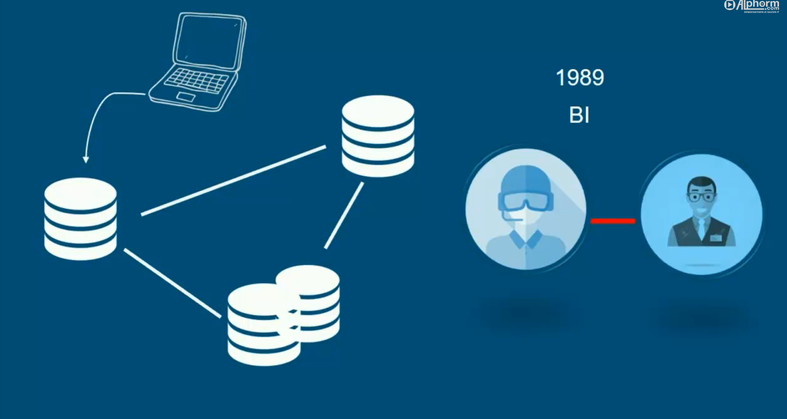

## Acteurs dominant sur le Marché de BI
 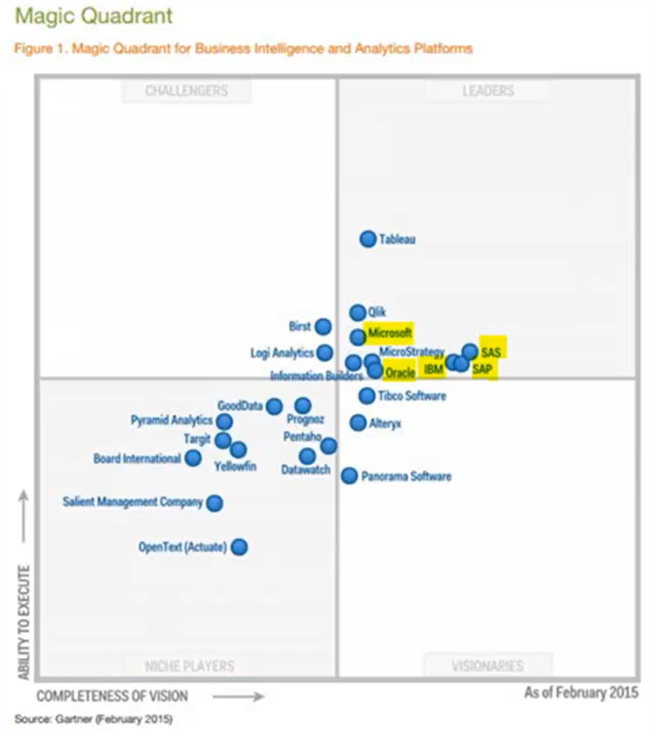
## Essentiel de BI

 ## Power BI: un hératage

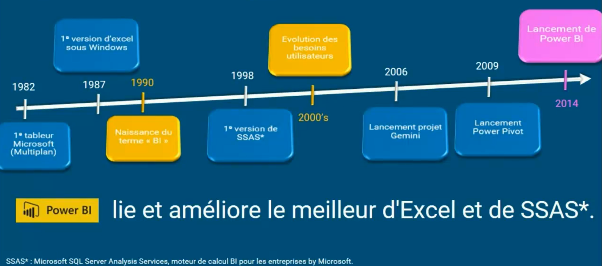

## Ce qu'il faut avoir en tête en travaillant Power BI

## 3 Outils de Power BI
   * **PowerBI Desktop**: C'est notre espace de travail donc c'est de là que nous allons construire nos rapport en suivant notre methode en cinq étapes 
   * **Power BI Service**: C'est le site internet **powerbi.microsoft.com** c'est de là qu'on accède via un login et il permet de faire un lien entre nos rapport que nous avons crée dans **Power BI Desktop** et les personnes avec lesquelles nous voulons collaborer.
   * **Power BI Mobile**: C'est une application qui est disponible sur **Android** et **IOS** qui permet avoir accèss à nos sur mobile de façon optimiser et configurer les notifications.
   
  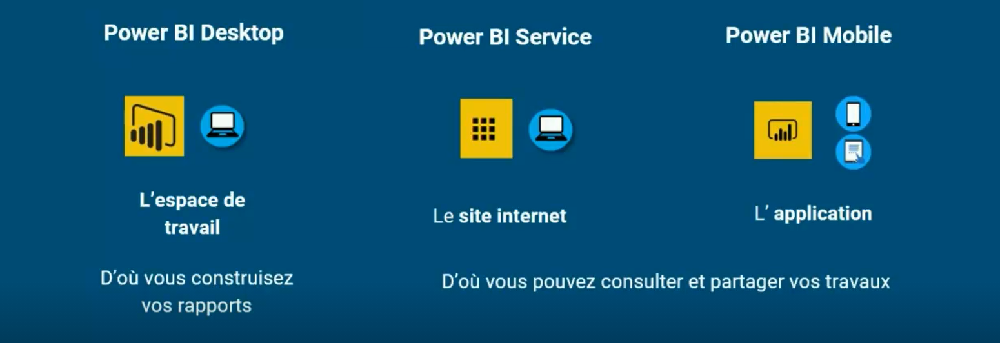
  ## Pour les Pros
  ### Power BI Premium

### Fonctionnalités de Power BI Premium
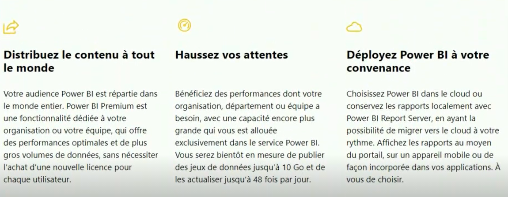

### Power BI Report Server

 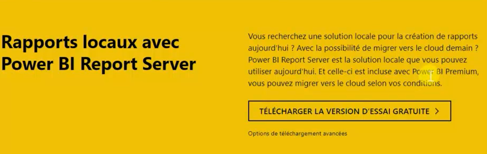

 ### Fonctionnalités de Power BI Report Server

### Power BI Embedded

## Notre Sujet d'études dans ce tutoriel

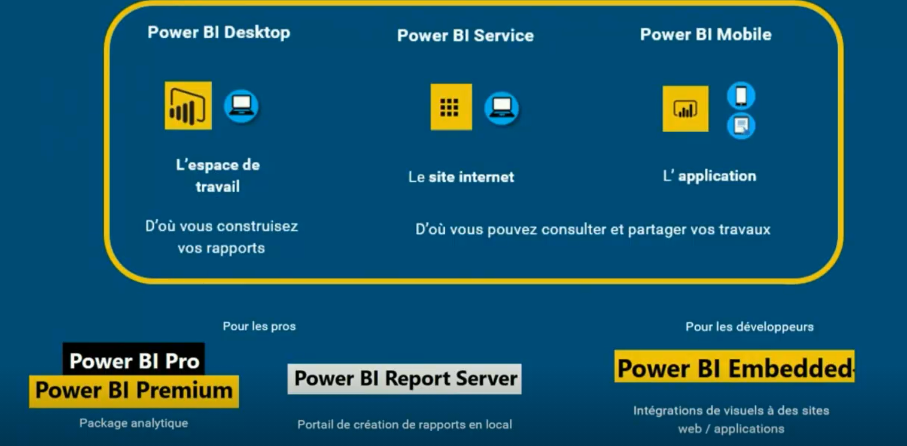

## Ce que fait Power BI 
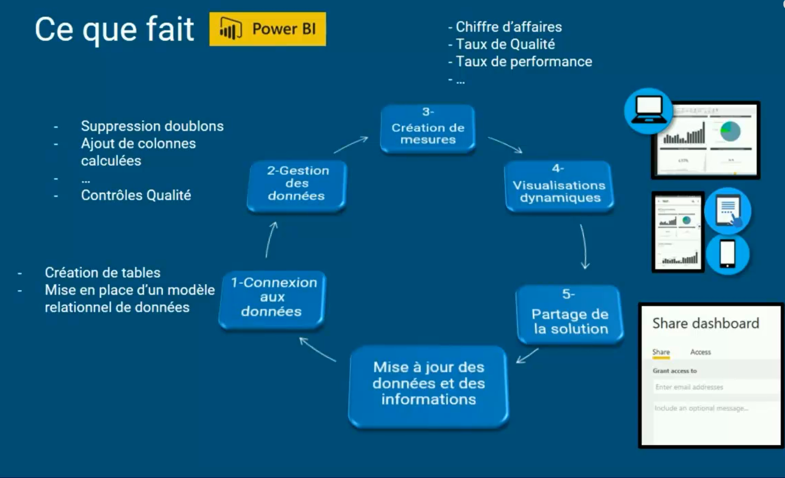

## Exemple de Rapport Power BI

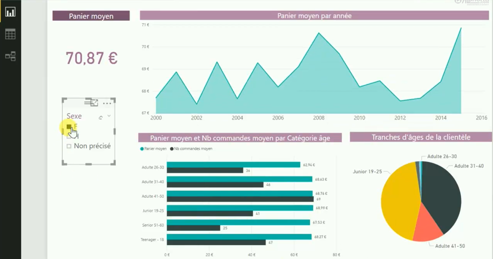

## Point Forts Stratégiques de Power BI

## Point Pratiques de Power BI

## Quand Utilisés Power BI

## Licences Power BI

## Méthodologie de travail
Dans ce cours, nous allons étudier les affaires d'une entreprise de vente de testile en ligne.

### Qu'est ce qu'on étudie Les ventes ?

### Quels sont les phénomènes ?

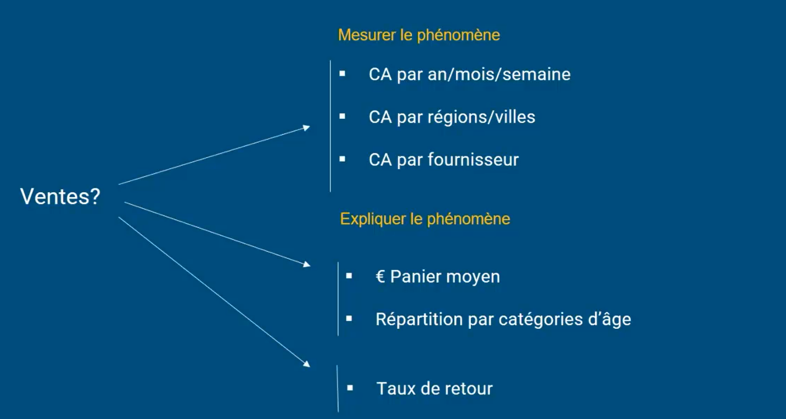

### Explication des phénomènes à travers un schema

## Etape 1: Se connecter à ses données 
* A: Faire le lien entre ses sources de données et notre rapport power BI Desktop. 
  Alors ces données peuvent être différentes les unes des autres :
  * Excel
  * csv
  * texte
  * access
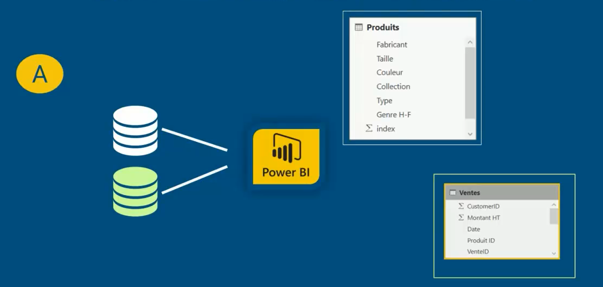
* B: permet de lier des tables entre elles. Pour créer un modèle relationnelle.
   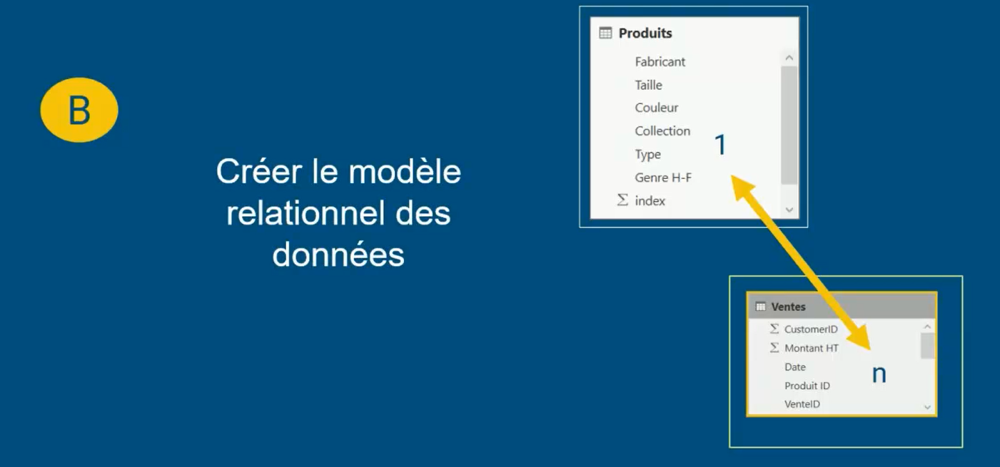
  
## Modèle relationnel des données
 
## Dans le cas des relation de plusieurs à plusieurs
  
## Une table peut être liée à plusieurs autres tables
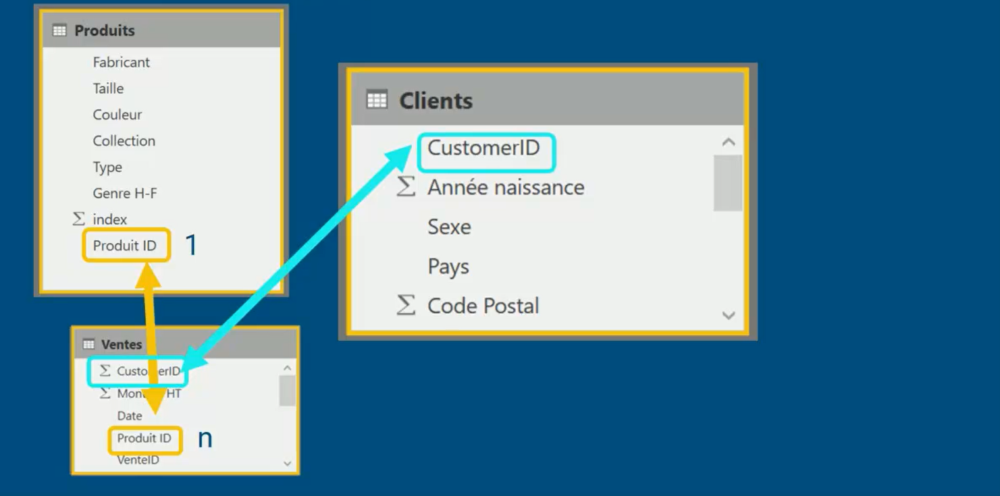 
## Différence entre une table de fait et une table de dimension
 
## Séparer les tables des faits aux tables des ventes
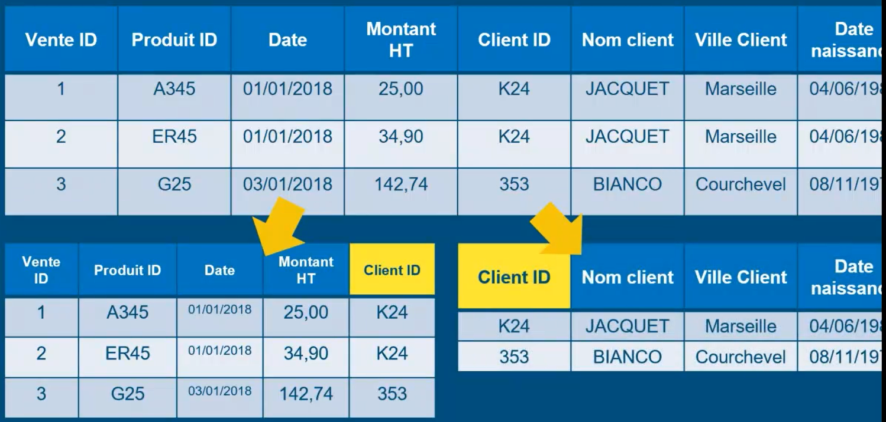
## Organiser visuellement

## Definir les relations
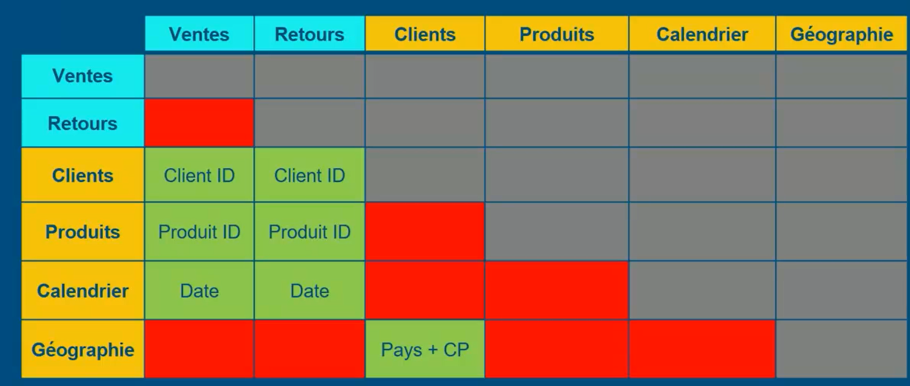

## Jointure interne

## Jointure externe

## Jointure externe entière
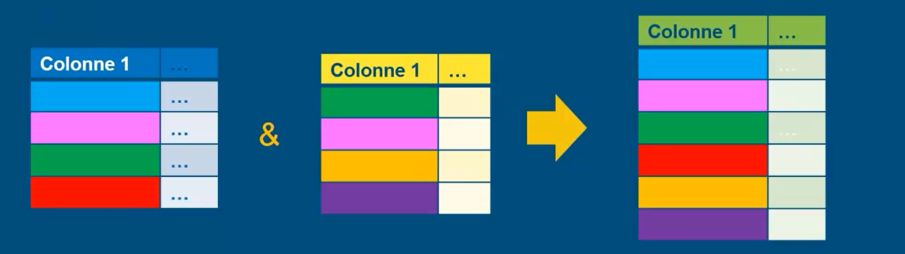

## Vérification des données

### 1- La complétude en terme de volume

### 2- La complétude en terme de couverture

### 3- La fiabilité

### 4- La pertinence

### 5- La qualité des rélation

## Formaliser

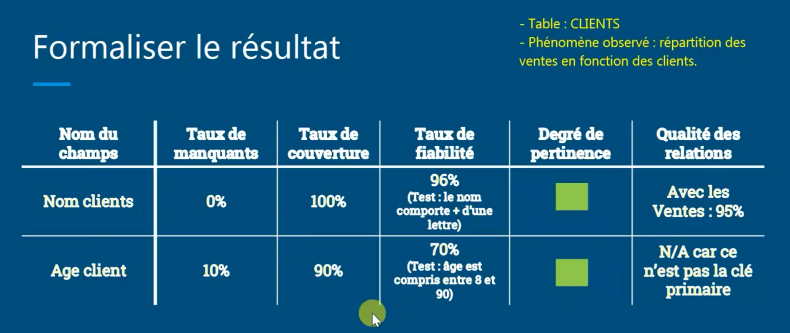