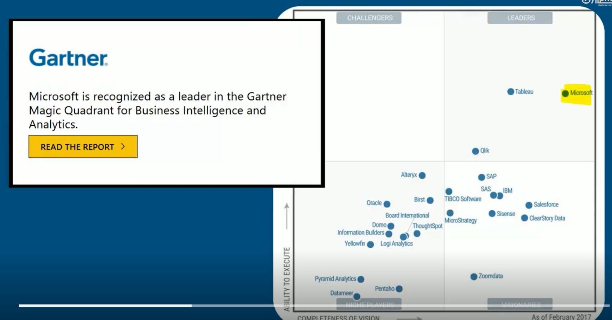
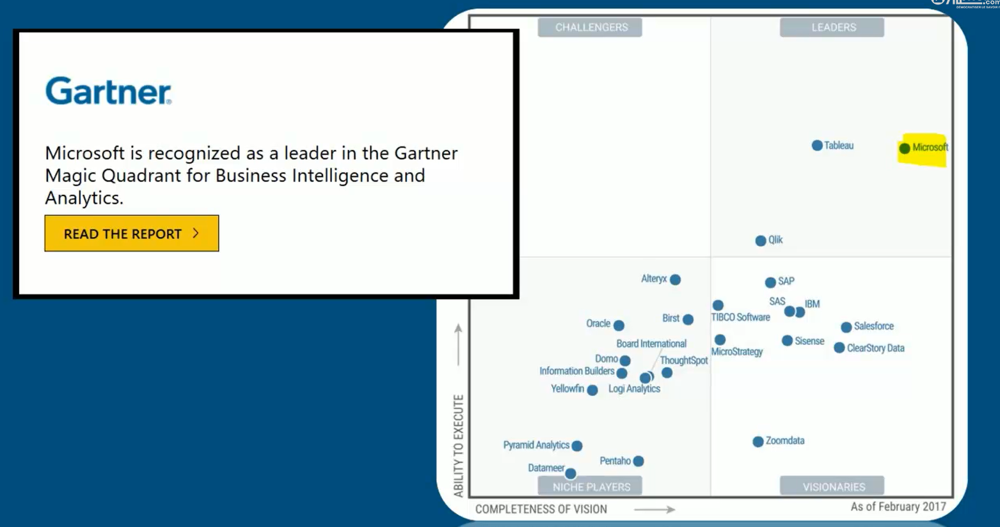

# Essentiel de Power BI
Power BI est un ensemble de services logiciels, d’applications et de connecteurs qui œuvrent ensemble pour transformer des sources de données disparates en informations visuelles immersives et interactives. Vos données peuvent être sous forme de feuille de calcul Excel ou de collection d’entrepôts de données hybrides locaux ou sur le cloud. Power BI vous permet de vous connecter facilement à vos sources de données, de visualiser et de découvrir ce qui est important, et de partager ces informations avec qui vous voulez.

## Business Intelligence
La Business Intelligence c'est un choix d'avenir. C'est une compétence précieuse qui est de plus en plus recherchée et devient indispensable à maitriser dans le IT. C'est aussi un outil qui a été conçu pour la BI accessible au plus grand nombre .
## Power BI 
Power BI est l'un des outils les plus efficients sur le marché. Et en plus il a un très bon rapport qualité prix sur le marché.

## Methodologie du Cours
Dans ce cours, nous allons suivre une methodologie part à part en cinq etapes pour que nous puissions créer nos reporting dynamic et interactif et être en mesure de partager nos travaux avec d'autres utilisateurs.

