# Essentiel de Power BI
Power BI est un ensemble de services logiciels, d’applications et de connecteurs qui œuvrent ensemble pour transformer des sources de données disparates en informations visuelles immersives et interactives. Vos données peuvent être sous forme de feuille de calcul Excel ou de collection d’entrepôts de données hybrides locaux ou sur le cloud. Power BI vous permet de vous connecter facilement à vos sources de données, de visualiser et de découvrir ce qui est important, et de partager ces informations avec qui vous voulez.

## Business Intelligence
La Business Intelligence c'est un choix d'avenir. C'est une compétence précieuse qui est de plus en plus recherchée et devient indispensable à maitriser dans le IT. C'est aussi un outil qui a été conçu pour rendre la BI accessible au plus grand nombre .
## Power BI 
Power BI est l'un des outils les plus efficients sur le marché. Et en plus il a un très bon rapport qualité prix sur le marché.

## Methodologie du Cours
Dans ce cours, nous allons suivre une methodologie part à part en cinq etapes pour que nous puissions créer nos reporting dynamic et interactif et être en mesure de partager nos travaux avec d'autres utilisateurs.

## La Business Intelligence & Power BI
<< Prise de decision sur la base d'informations probantes >>  
  =  
  démontrer que l'on prend une décision intelligente.

  
  
## Historique
* Création des base de donnée en 1969 par Edgar Codd
* Naissance des application de collecte de donnée en 1970 encestre d'excel
* Puis il y a eu les bésoin de croiser les donnée d'où est né les entrepôts de données ( datawarehouse ) en 1980 qui permet un meilleurs accèss et gestion des données.
* en suite les bésoins continuaient d'augmenter ce qui à provoqué la naissance de BI en 1989 evoquer pour première fois .
  

## Acteurs dominant sur le Marché de BI
 
## Essentiel de BI

 ## Power BI: un hératage

## Ce qu'il faut avoir en tête en travaillant Power BI

## 3 Outils de Power BI
   * **PowerBI Desktop**: C'est notre espace de travail donc c'est de là que nous allons construire nos rapport en suivant notre methode en cinq étapes 
   * **Power BI Service**: C'est le site internet **powerbi.microsoft.com** c'est de là qu'on accède via un login et il permet de faire un lien entre nos rapport que nous avons crée dans **Power BI Desktop** et les personnes avec lesquelles nous voulons collaborer.
   * **Power BI Mobile**: C'est une application qui est disponible sur **Android** et **IOS** qui permet avoir accèss à nos sur mobile de façon optimiser et configurer les notifications.
   
  
  ## Pour les Pros
  ### Power BI Premium

### Fonctionnalités de Power BI Premium

### Power BI Report Server

 

 ### Fonctionnalités de Power BI Report Server

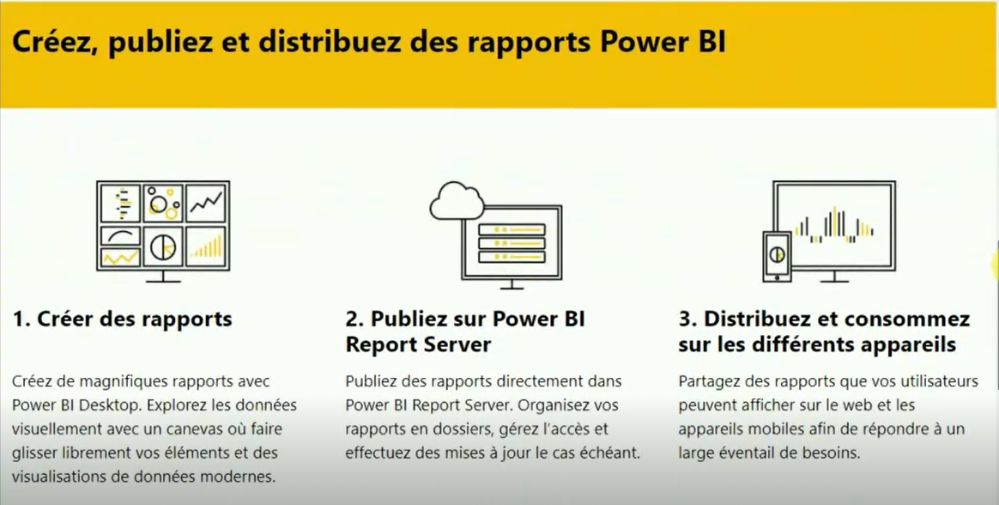

### Power BI Embedded

## Notre Sujet d'études dans ce tutoriel

## Ce que fait Power BI 

## Exemple de Rapport Power BI

## Point Forts Stratégiques de Power BI

## Point Pratiques de Power BI

## Quand Utilisés Power BI

## Licences Power BI

## Méthodologie de travail
Dans ce cours, nous allons étudier les affaires d'une entreprise de vente de testile en ligne.

### Qu'est ce qu'on étudie Les ventes ?

### Quels sont les phénomènes ?

### Explication des phénomènes à travers un schema
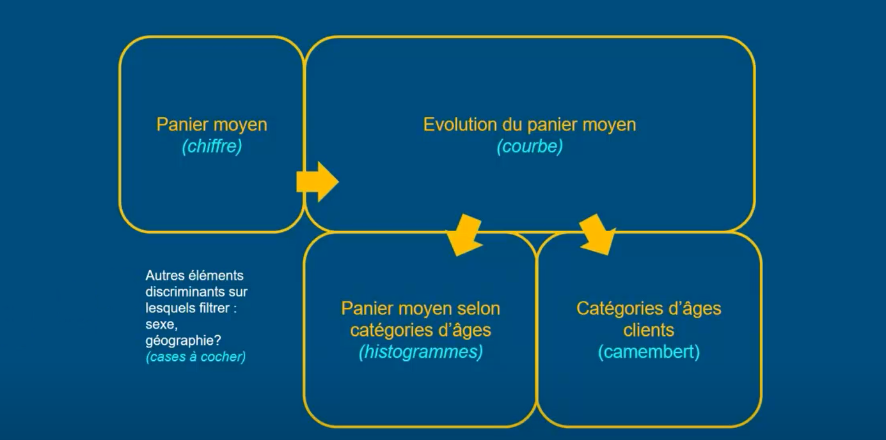

## Etape 1: Se connecter à ses données 
* A: Faire le lien entre ses sources de données et notre rapport power BI Desktop. 
  Alors ces données peuvent être différentes les unes des autres :
  * Excel
  * csv
  * texte
  * access

* B: permet de lier des tables entre elles. Pour créer un modèle relationnelle.
   
  
## Modèle relationnel des données
 
## Dans le cas des relation de plusieurs à plusieurs
 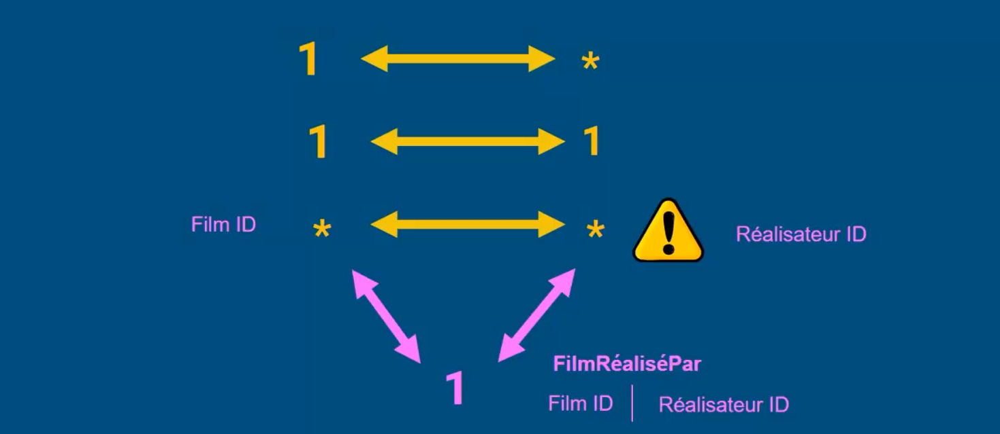 
## Une table peut être liée à plusieurs autres tables
 
## Différence entre une table de fait et une table de dimension
 
## Séparer les tables des faits aux tables des ventes

## Organiser visuellement
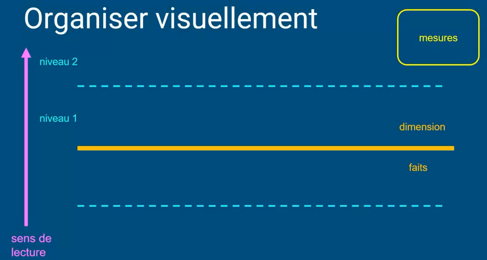
## Definir les relations

## Jointure interne
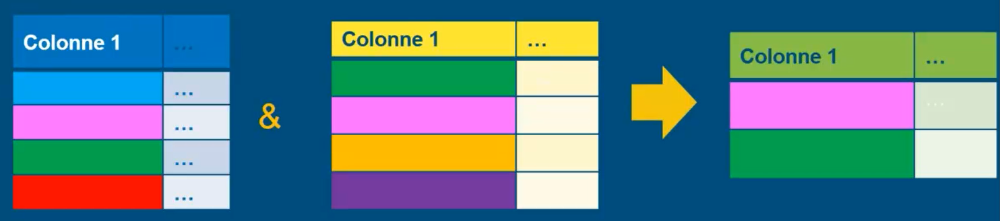
## Jointure externe
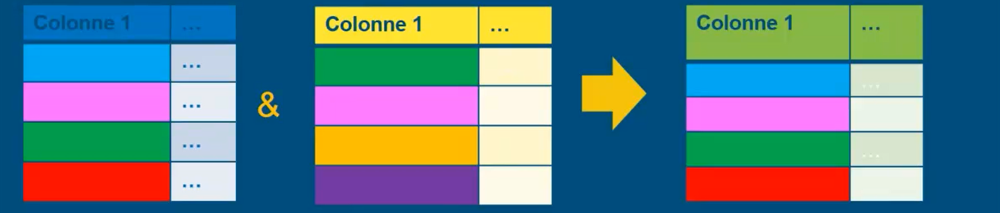
## Jointure externe entière

## Vérification des données

### 1- La complétude en terme de volume

### 2- La complétude en terme de couverture

### 3- La fiabilité

### 4- La pertinence

### 5- La qualité des rélation

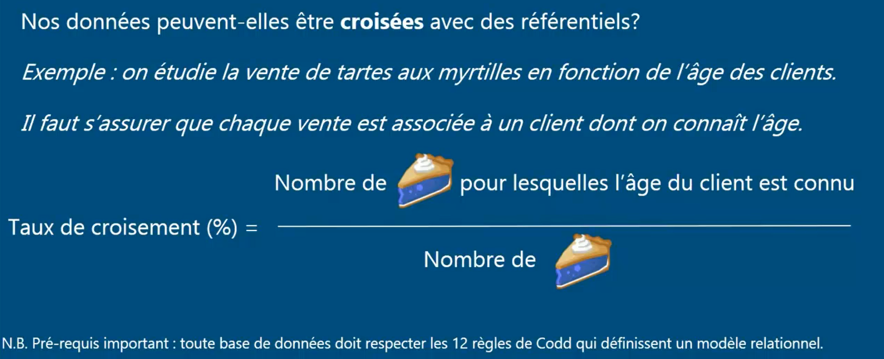
## Formaliser

## Type de calcul en PowerBI

## Création des colonnes calculées et mesures

### 4 étapes de calcul en DAX

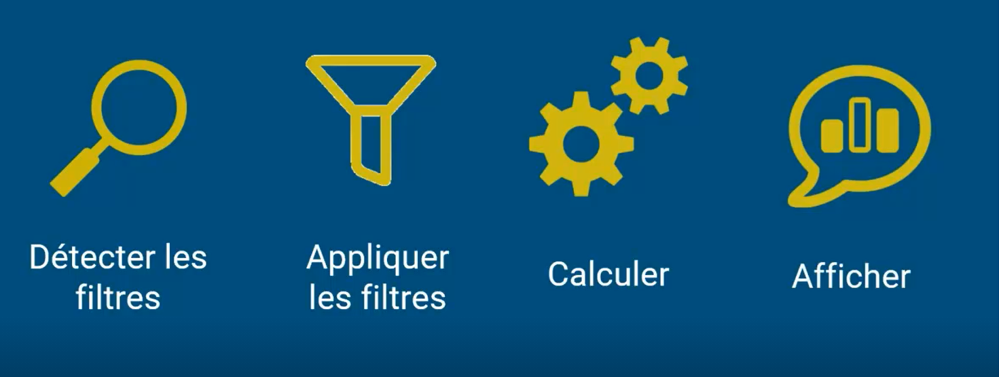

## Annuaire des fonction DAX

## Quelques conseils
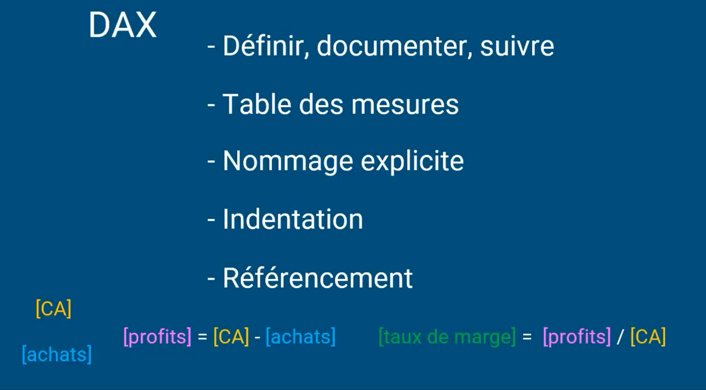

## Quelques fonctions usuelles DAX 

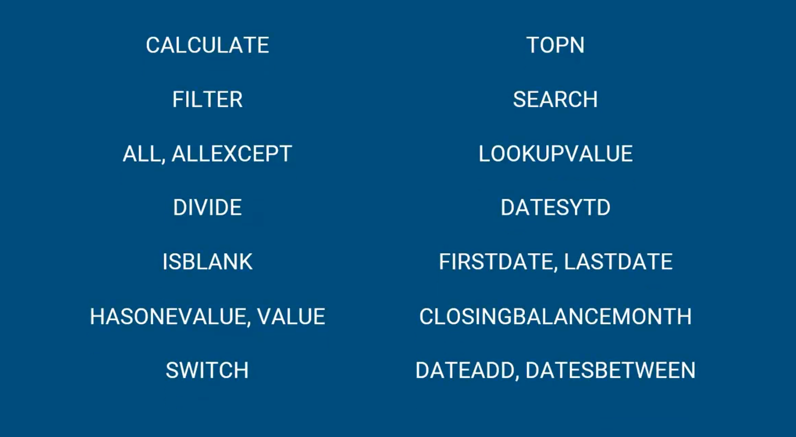

## La fonction CALCULATE

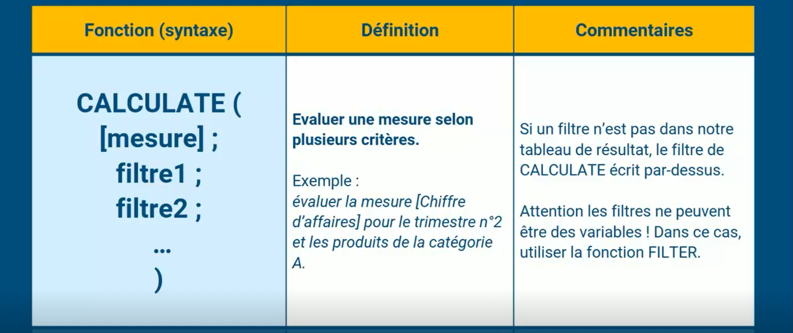

## La fonction FILTER

## Les SLICERS

[bi 59](images/59.png)

## La fonction DIVIDE

## La fonction ISBLANK

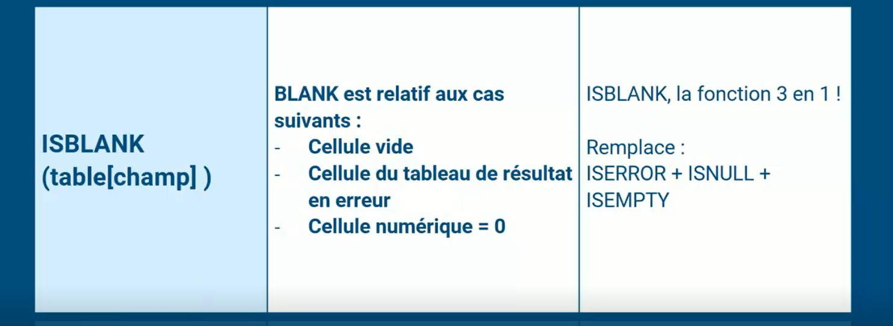

## La fonction SWITCH

## La fonction TOPN

## La fonction SEARCH

## La fonction LOOKUPVALUE

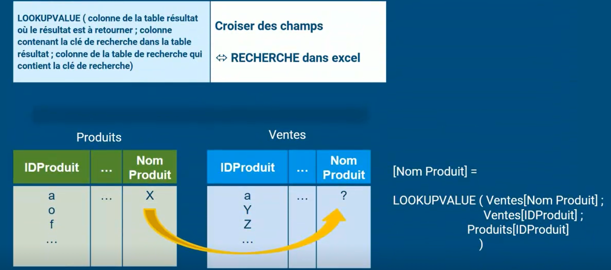

## La fonction DATESYTD

## Quelques autres fonctions

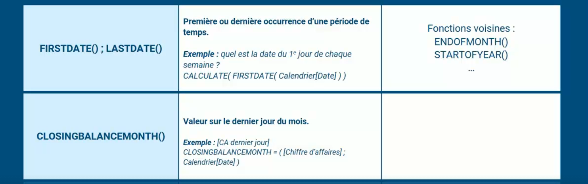
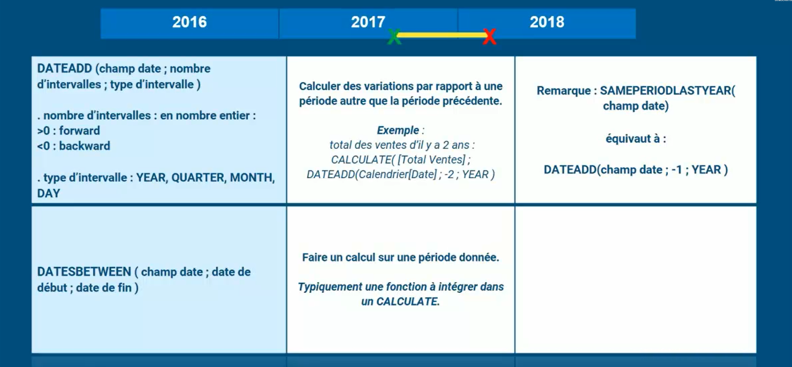

## Les XFounction

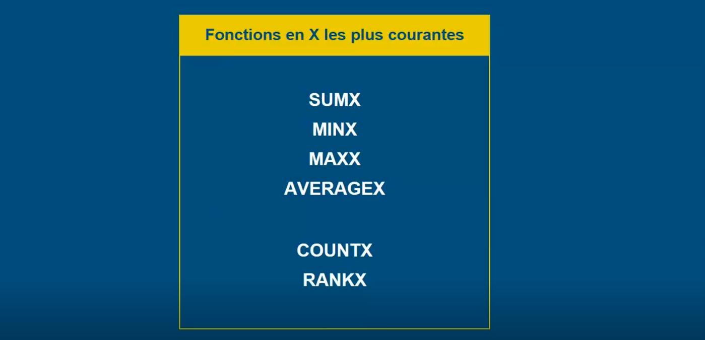

## Présentation 

### Mode de répresentation 
Dans le monde de la visualisation, il y a quatre modes de représentation courant utilisés.

1. Il y a les **Rapports**: c'est un ensemble de graphique qui sont commentés avec du text qui sert à un phenomène en profondeur, à argumenter un point de vue ou à proposer des solution.
   
2. **Dashbords**: un dashbord est un ensemble de graphique qui met en disposition du decideur des chiffres clés ou la synthèse d'une activité ou un phenomène sous plusieurs dimensions.
   
3. **Visuels Exploratoires**: c'est une series de boutons, de filtre et d'options à chocher et decocher qui vous permet d'explorer des données.
   
4. **Les Infographies**: ce sont des visuels vraiment pédagogiques.
  
   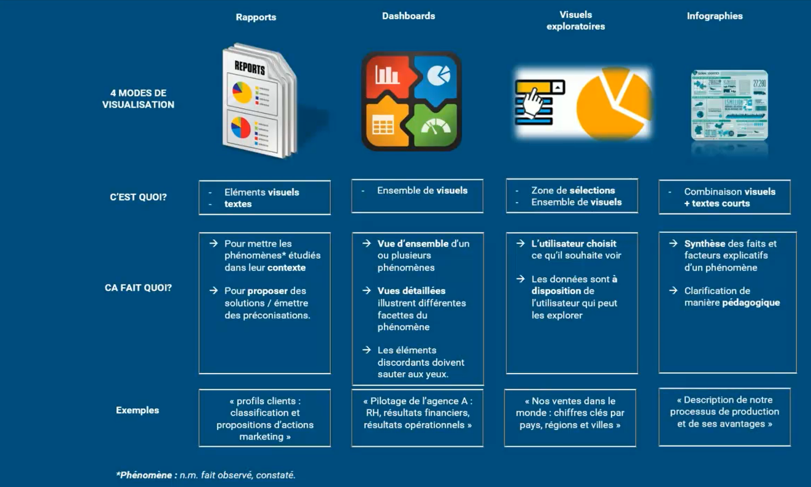
## Choix du mode de visualisation
Pour choisir votre mode de visualisation, il faut prendre en compte deux critères qui réviennent à se poser les questions:

1. **Quel est mon public, quelle est ma cible**: c'est à dire à qui s'adresse mes informations, qui va les lire.

    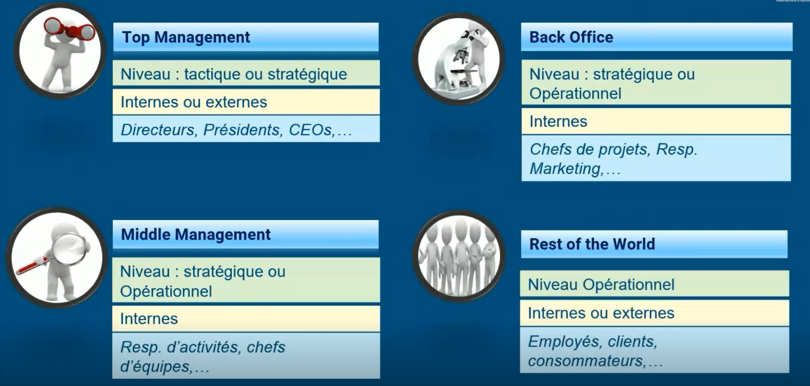

    Donc une bonne manière de distinguer ces cibles, c'est en observant leurs niveaux hierarchiques et le niveau d'information dont ils ont bésoins.

    Un autre point important est d'observer s'ils sont internes ou externes à notre organisation.

2. **L'objectif de la cible**: il faut se rappeler que les visuels servent à présenter les informations à partir des données, en fait ils servent à rendre l'invisible visible. Mais c'est pourquoi vous avez bésoin de rendre l'invisible visible ou pourquoi vous avez bésoin de comprendre le phénomène que vous étudiez. ça pourrait être de prendre des décisions, d'analyser quelques choses plus en détail, de piloter au quotidien une activité, d'expliquer un phénomène précis.
   
   

## Map de Visualisation

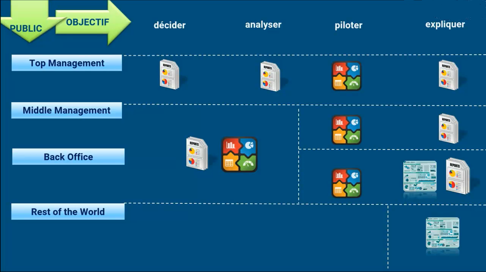

## Organiser 
Pour la création d'un dashbord. Si on ne les décompose pas bien, on crée la comlexité, on freine la lecture et on manque de clarté. 

Donc la solution c'est de bien découper nos visuels page par page et chaque en différets segment.

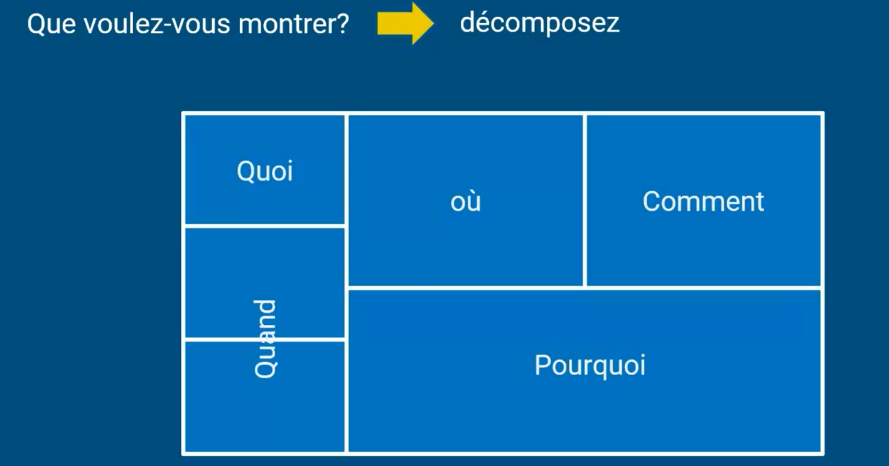

Il faut aussi structurer les information et les hiérachiser c'est à dire donnée un sens de lecture et lors qu'on voie il faut que notre visuel saute au yeux. par exemple en commençant par les informations les plus importantes en haut à gauche parce que c'est naturellement de là que notre regarde porte en premier lieu ce sont des techniques des journalistes de  la presse donc à mesure que notre regard balaye la page du haut à gauche vers la droite en bas. Il faut qu'on puisse entrée dans les niveaux de détails plus micro.

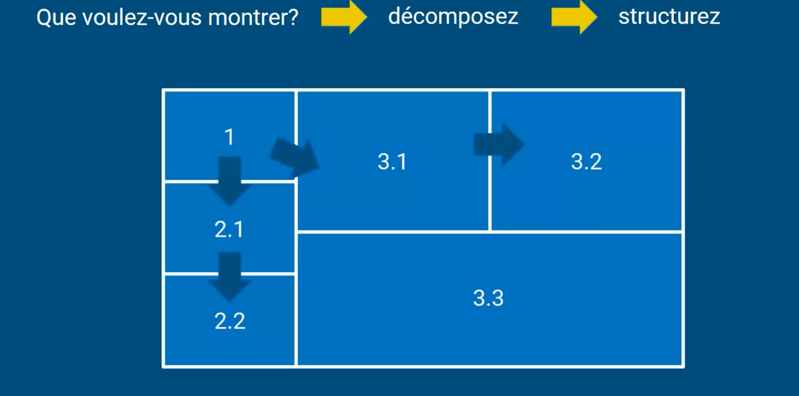
